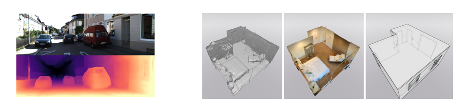
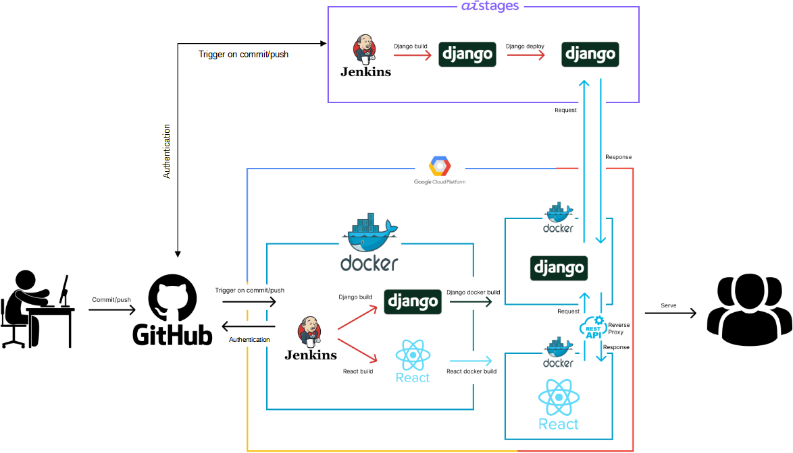

# level3_cv_finalproject-cv-13

https://www.youtube.com/watch?v=XD1V6d-P9dM


> “PocketHome”은 임의의 2차원 실내 panorama image로부터 3차원의 점들로 이루어진 가상 환경을 보여주는 service입니다. 기존의 2D to 3D reconstruction solution들이 산업용이나 고가의 장비(LiDAR 등)를 필요로 한다는 데에 착안 하여 일반인들이 개인의 공간을 휴대전화 단말기 등으로 panorama 사진을 찍어서 쉽게 3차원으로 재구성 하여 어디서든 볼 수 있게 끔 하고자 했습니다.

## 프로젝트 선정 배경

> 일상생활을 하며 추억을 보존하고 싶을 때가 많이 생깁니다. 그럴 때 보통 저희는 사진을 찍거나, 동영상으로 당시의 느낌을 저장하곤 합니다. 저희는 이러한 추억에 현장감을 한층 더 추가하고자 프로젝트를 시작하게 되었습니다.
> 

### 추억을 보존하는 수단?


### 3D Depth Estimation 을 이용한 3D 재구성


## Model Pretrained
---
https://drive.google.com/file/d/1T-T8HMRLuEol7k7DLsyzBx2YI5xf_32W/view?usp=sharing

## 🏚project architecture

> CI/CD 는 Jenkins 로 관리하였고 github 에 분리해둔 front, back, ai 브랜치가 각각 push 될때마다 해당 server 를 자동으로 배포하게 하는 방식으로 진행하였습니다.


### Data Flow

## Directory
```bash
└─level3_cv_finalproject-cv-13
    ├─model
    │  ├─ai_server
    │  │  └─__pycache__
    │  ├─images
    │  │  ├─migrations
    │  │  │  └─__pycache__
    │  │  └─__pycache__
    │  ├─inference
    │  │  ├─config
    │  │  │  ├─mp3d_depth
    │  │  │  │  └─ablation
    │  │  │  ├─mp3d_layout
    │  │  │  ├─s2d3d_depth
    │  │  │  └─s2d3d_sem
    │  │  ├─data
    │  │  ├─lib
    │  │  │  ├─dataset
    │  │  │  ├─misc
    │  │  │  └─model
    │  │  │     ├─backbone
    │  │  │     ├─horizon_compression
    │  │  │     ├─horizon_refinement
    │  │  │     ├─horizon_upsample
    │  │  │     └─modality
    │  │  ├─misc
    │  │  └─result
    │  │     ├─aligned
    │  │     ├─depth
    │  │     └─pcd
    │  └─static
    ├─serving
    │  ├─back
    │  │  ├─back
    │  │  └─images
    │  │     └─migrations
    │  └─front
    │     ├─public
    │     └─src
    │        ├─design
    │        ├─fonts
    │        ├─pages
    │        │  ├─about
    │        │  │  └─item
    │        │  ├─home
    │        │  ├─image
    │        │  │  ├─load_page
    │        │  │  ├─sendImage
    │        │  │  └─showPcd
    │        │  └─main
    │        └─ui
    └─utility
```
